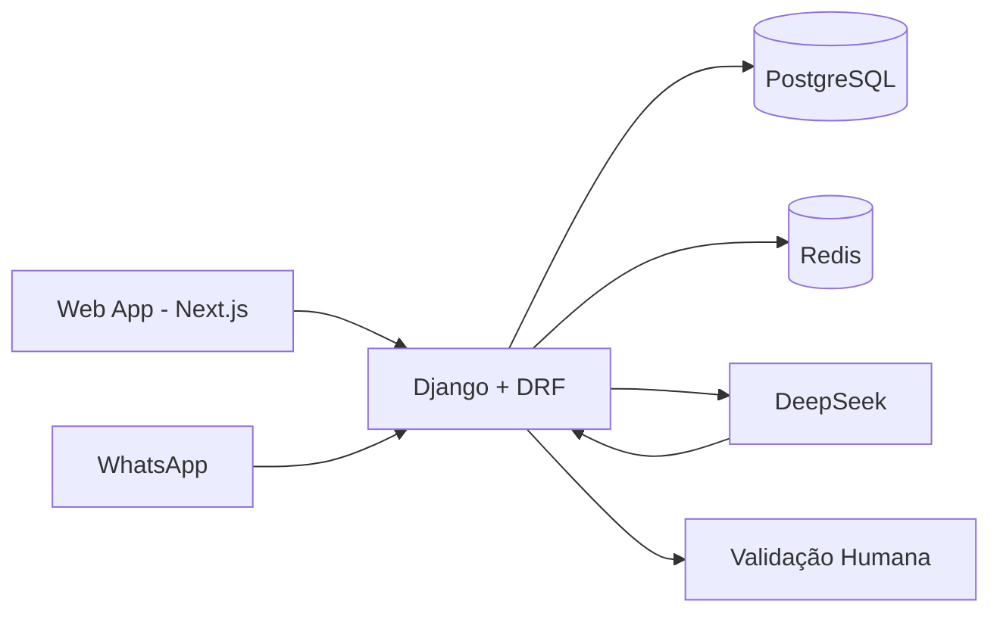

# 03 — Arquitetura Técnica

## 1. Stack confirmada

| Camada | Tecnologia |
|---|---|
| Backend | Django + Django REST Framework |
| Frontend | Next.js |
| Banco de dados | PostgreSQL |
| Cache | Redis |
| Inteligência artificial | DeepSeek |
| WhatsApp | Webhook próprio |
| Autenticação | JWT + refresh token |

## 2. Arquitetura lógica



## 3. Módulos propostos

A separação abaixo é **PROPOSTA** para organizar a implementação:

```text
backend/
├── accounts/
├── patients/
├── laboratories/
├── resellers/
├── pharmacies/
├── technicians/
├── requests/
├── quotations/
├── scheduling/
├── payments/
├── commissions/
├── whatsapp/
├── ai/
├── notifications/
├── audit/
└── core/
```

## 4. Responsabilidades

### accounts
- autenticação;
- usuários;
- papéis;
- permissões;
- bloqueio;
- refresh token.

### requests
- solicitação;
- anexos;
- status;
- histórico.

### quotations
- rascunho;
- itens;
- revisão humana;
- orçamento final;
- aprovação.

### scheduling
- agenda;
- local;
- modalidade;
- confirmação;
- conclusão.

### commissions
- regra;
- cálculo;
- lançamento;
- estorno;
- extrato.

### whatsapp
- webhook;
- normalização;
- conversa;
- mensagens;
- anexos;
- correlação com paciente/solicitação.

### ai
- extração estruturada;
- intenção;
- classificação;
- rascunho;
- validações de confiança.

## 5. Regras arquiteturais

1. A IA não deve escrever diretamente o orçamento final.
2. Toda transição crítica deve ocorrer no backend.
3. O frontend nunca deve ser fonte de verdade para estados.
4. O banco deve manter histórico de transições.
5. Comissão deve ser calculada por regras configuráveis.
6. Integrações externas devem ser desacopladas por serviços/adapters.

**Status:** itens 1 e parte dos fluxos são CONFIRMADOS; restante é PROPOSTO.
