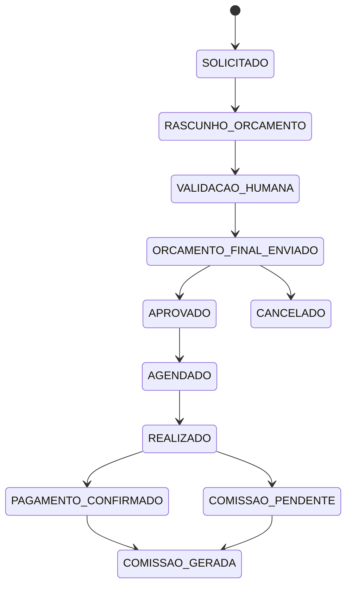

# 05 — Fluxo de Agendamento e Máquina de Estados

## 1. Fluxo consolidado



## 2. Estados recomendados

| Código | Nome | Observação |
|---|---|---|
| REQUESTED | Solicitado | pedido criado |
| QUOTE_DRAFT | Rascunho do orçamento | gerado/organizado pela IA |
| WAITING_HUMAN_VALIDATION | Validação humana | revisão obrigatória |
| QUOTE_SENT | Orçamento final enviado | enviado por atendente |
| APPROVED | Aprovado | paciente aprovou |
| SCHEDULED | Agendado | protocolo/data/hora/local |
| IN_PROGRESS | Em realização | opcional, se necessário |
| COMPLETED | Realizado | coleta concluída |
| PAYMENT_PENDING | Pagamento pendente | não bloqueia coleta |
| PAYMENT_CONFIRMED | Pagamento confirmado | financeiro |
| COMMISSION_PENDING | Comissão pendente | aguardando gatilho |
| COMMISSION_GENERATED | Comissão gerada | lançamento criado |
| CANCELED | Cancelado | final alternativo |

**Status:** nomes técnicos são PROPOSTOS; conceitos principais são CONFIRMADOS.

## 3. Regra crítica

A IA produz apenas o rascunho.

```text
IA → rascunho → validação humana → orçamento final → paciente
```

## 4. Pagamento

O fluxo fornecido afirma:

> O pagamento não bloqueia a realização da coleta.

Portanto o backend não deve impedir `COMPLETED` apenas porque `PAYMENT_PENDING`.

## 5. Histórico

**PROPOSTO:** toda mudança deve gerar uma linha em `request_status_history` contendo:

- estado anterior;
- estado novo;
- usuário/sistema responsável;
- data/hora;
- origem;
- motivo;
- metadados.
