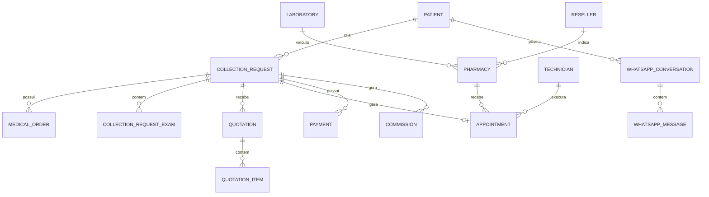

# 06 — Modelo de Dados

## 1. Observação

O material recuperado não contém o esquema original de banco.  
O modelo abaixo é **PROPOSTO** a partir dos requisitos confirmados.

## 2. Entidades principais

### User
- id
- email
- phone
- password_hash
- role_id
- is_active
- failed_login_attempts
- locked_until
- created_at
- updated_at

### Role
- id
- code
- name

### Permission
- id
- code
- name

### Patient
- id
- user_id
- name
- phone
- email
- document
- birth_date
- created_at

### Laboratory
- id
- name
- document
- owner_id
- status
- created_at
- updated_at

### Reseller
- id
- user_id
- laboratory_id
- status

### Pharmacy
- id
- user_id
- laboratory_id
- reseller_id
- name
- document
- address
- city
- state
- zip_code
- status

### Technician
- id
- user_id
- laboratory_id
- reseller_id
- name
- professional_registration
- status

### CollectionRequest
- id
- protocol
- patient_id
- desired_date
- desired_period
- collection_mode
- preferred_location
- status
- created_at
- updated_at

### MedicalOrder
- id
- request_id
- file_url
- mime_type
- uploaded_at

### Exam
- id
- code
- name
- active

### CollectionRequestExam
- id
- request_id
- exam_id
- extracted_name
- quantity
- notes

### Quotation
- id
- request_id
- type
- version
- subtotal
- total
- status
- generated_by_ai
- validated_by_user_id
- validated_at
- sent_at

### QuotationItem
- id
- quotation_id
- exam_id
- description
- quantity
- unit_price
- total_price
- source

### Appointment
- id
- request_id
- pharmacy_id
- technician_id
- laboratory_id
- scheduled_at
- collection_mode
- status
- checkin_at
- checkout_at
- completed_at

### Payment
- id
- request_id
- amount
- method
- status
- external_reference
- paid_at

### CommissionRule
- id
- beneficiary_type
- beneficiary_id
- calculation_type
- value
- trigger
- valid_from
- valid_until
- active

### Commission
- id
- request_id
- beneficiary_type
- beneficiary_id
- rule_id
- base_amount
- amount
- status
- generated_at
- paid_at

### WhatsAppConversation
- id
- patient_id
- phone
- status
- current_request_id
- created_at
- updated_at

### WhatsAppMessage
- id
- conversation_id
- provider_message_id
- direction
- type
- content
- attachment_url
- received_at
- sent_at

### AuditLog
- id
- user_id
- action
- entity_type
- entity_id
- ip
- user_agent
- metadata
- created_at

## 3. Relacionamentos

## 4. Pontos pendentes

- CPF obrigatório ou opcional?
- CNPJ obrigatório?
- identificador de conselho profissional do técnico;
- múltiplos laboratórios por farmácia;
- múltiplos revendedores por farmácia;
- catálogo global ou por laboratório;
- preço por exame, região, unidade ou parceiro.

## Locais de coleta e contatos WhatsApp (demandas D-03/D-04)

### CollectionPoint
- id
- laboratory_id
- kind (pharmacy | laboratory)
- pharmacy_id (quando kind=pharmacy)
- name
- address
- city
- state
- zip_code
- latitude
- longitude
- is_open
- status
- created_at
- updated_at

### OpeningWindow
- id
- point_id
- weekday (0=segunda .. 6=domingo)
- open_time
- close_time

### TechnicianAssignment
- id
- point_id
- technician_id
- assigned_by
- active
- created_at

### CollectionPointSession
- id
- point_id
- opened_by
- open_at
- closed_by
- closed_at

### WhatsAppContact
- id
- owner (exatamente um): pharmacy_id | laboratory_id | technician_id | reseller_id
- number (normalizado)
- name
- meta_bsuid ("@nome.usuario" — Meta)
- is_main
