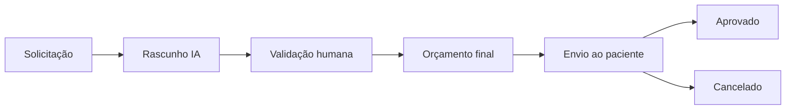

# 09 — Orçamentos e Validação Humana

## 1. Conceito

Existem dois objetos distintos:

### Rascunho
Gerado ou organizado pela IA.

### Orçamento final
Revisado e enviado por uma pessoa autorizada.

Essa separação deve existir no domínio e não apenas na interface.

## 2. Fluxo



## 3. Regras

### RN-ORC-001
Um rascunho não pode ser considerado orçamento final.

### RN-ORC-002
Um orçamento final deve possuir `validated_by` e `validated_at`.

### RN-ORC-003
O sistema deve bloquear o envio de orçamento não validado.

### RN-ORC-004
A edição posterior à validação deve invalidar a validação anterior ou criar uma nova versão.

**Status:** RN-ORC-004 é PROPOSTA.

### RN-ORC-005
A aprovação do paciente deve registrar data/hora e versão aprovada.

**Status:** PROPOSTO.

## 4. Versionamento recomendado

```text
Cotação #100
  v1 — rascunho
  v2 — corrigido pelo atendente
  v3 — enviado ao paciente
```

## 5. Origem de preço

O material não informa onde estão os preços dos exames.

Possibilidades a decidir:

- tabela do laboratório;
- tabela por farmácia;
- tabela por unidade;
- integração externa;
- entrada manual.

**Status:** PENDENTE.
